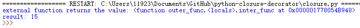

## 函数式编程:闭包
```
# Source
def outer_func(x):  # 这是外部函数
    def inter_func(y):  # 这是内部函数
        return x+y  # 内部函数返回x+y的值
    return inter_func  # 外部函数返回的是一个函数对象
```
> 外部函数`closure_test`返回值是内部函数的对象引用，
> 内部函数`inter_func`对外在作用域(不是全局作用域)的变量x进行了引用返回x+y值。
```
# Test
c = outer_func(5)
print("external function returns the value:",c)
print("result:",c(10))
```
> Result:  
>  
> 对函数进行了测试，可以通俗的概况出闭包的作用就是用一个外部函数提供给一个内部函数变量环境，
> 内部函数可以使用外部函数提供的环境来执行相关操作，内部函数能够合理地变换这个环境。
> 闭包=函数块+定义函数时的环境，此时的函数块是inter_func，环境就是outer_func提供的x变量。

